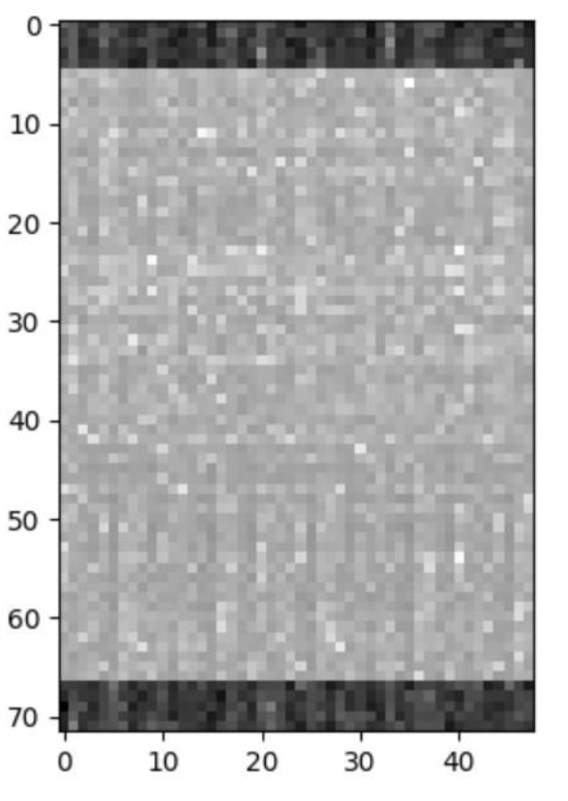

## 1 Úvod

Všichni denně používáme mobilní telefony. Jsou naším spojením s rodinou a přáteli, pomáhají nám vyhledávatvyhledávat informace atd. Mobilní telefon musí být vždy připojen k síti, a to prostřednictvím tzv. základnové stanice (jako je např.
telekomunikační inženýři, jim říkáme eNodeB nebo gNodeB).

V mobilních sítích však mohou existovat útočníci, kteří využívají bezpečnostních slabin. S využitím
specializovaného hardwaru a softwaru mohou ukrást některé informace, odesílat škodlivé zprávy nebo sledovat uživatele. Jedním z nich je např.
známých nástrojů je takzvaná falešná základnová stanice (False Base Station, FBS), někdy nazývaná Rogue Base Station (RBS) nebo International
Mobile Subscriber Identifier (IMSI) Catcher. Jedná se o zařízení, které se vydává za legitimní základnovou stanici a snaží se
mobilní terminály připojit.

Falešná základnová stanice se tedy musí chovat jako legitimní stanice, tj. musí vysílat stejné informace jako legitimní stanice.
do rádiového kanálu.

## 2 Popis zadání

Struktura rámce signálu 4G/LTE vysílaného ze základnové stanice je znázorněna v levé části obr. 1. Rozhodující část
přenášených informací jsou tzv. synchronizační sekvence. Jsou dvě - primární synchronizace
(PSS) a sekundární synchronizační sekvence (SSS). Během naší měřicí kampaně jsme zachytili
obrovské množství takových sekvencí a použili je k výpočtu frekvenčních odezv kanálu. Z těchto kanálových
frekvenčních odezv jsme vytvořili vzorky, které budete zpracovávat. Příklad jednoho vzorku vizualizovaného ve 2D je uveden na obrázku
v pravé části obrázku 1. Všimněte si, že se skládá ze 72 řádků (odpovídajících 72 subnosným přiděleným PSS/SSS) a 48
sloupců (odpovídajících 48 opakováním frekvenční odezvy kanálu).

<small>levá část obr.1</small>

<small>pravá část obr.1</small>

Cílem vašeho projektu je klasifikovat, zda ze sousední budovy vysílá pouze legitimní základnová stanice (gNodeB) operátora T-Mobile (třída 0), nebo zda útočník do budovy přinesl podvodný vysílač a snaží se zachytit uživatelské informace (třída 1 nebo třída 2). Základnová stanice útočníka se může nacházet na jednom ze dvou míst - třída 1 odpovídá prvnímu místu a třída 2 druhému.

Dataset je zde:  [DATASET](https://github.com/mrbutterfly105/MPA-MLF-Project/tree/main/DATASET).

Dataset obsahuje následující soubory soubory:

1. `Train/` – složka s trénovacími daty ve formátu `.npy`.
2. `Test/` – složka s testovacími daty ve formátu `.npy`.
3. `label_train.csv` – soubor `.csv` s popisky (labely) k trénovacím datům.
4. `test_format.csv` – ukázkový soubor s formátem dat pro odevzdání výsledků.

Poznámka: Není nutné zpracovávat vzorky jako 2D obrázky – je možné je převést například i na 1D vektory apod.

## 3 Kroky

Vaším úkolem je vytvořit klasifikační modul, který bude správně fungovat při řešení výše popsané úlohy. Nepředepisujeme typ ML modelu. Můžete použít jakoukoli architekturu, kterou jsme probírali v průběhu semestru (nebo jakoukoli jinou, kterou
kterou znáte). Snažte se dosáhnout co nejvyšší přesnosti testu. Vylaďte výkonnost svého modelu pomocí libovolného
technik, které jsme probírali, jako je rozšiřování dat, regularizace, dávková normalizace atd. Kromě toho použijte
algoritmus pro ladění hyperparametrů, abyste našli nejlepší hyperparametry a strukturu modelu. Popište svůj přístup
ve zprávě.

## 4 - Not importamt

## 5 Obecné připomínky
- Zpráva by měla mít všechny nezbytné formální náležitosti, které má zpráva podobného typu (úvod, problematika, příprava a zpracování zprávy,
popis, hlavní část práce, závěry, všechny obrázky a tabulky by měly mít popisky a číslování
a měly by na ně být odkazy v textu atd.). To byste měli znát (přinejmenším) z bakalářského studia.
bakalářské práce.
- Do zprávy nezahrnujte snímky obrazovky vašeho kódu. Pokud chcete popsat některé ze svých algoritmů, použijte
pseudokód/flow diagramy. Nepopisujte známé algoritmy.
- Neprezentujte svou práci ve zprávě jako prostý text. K zobrazení a prezentaci použijte grafy, obrázky a tabulky.
příslušné informace.
- Veškeré kódování musíte provádět v jazyce Python. Nemusíte provádět veškeré kódování od začátku, ale jste povinni.
všichni smíte používat knihovny a rámce Pythonu (například Keras, PyTorch, Scikit-learn..).
- Použití Google Collab je důrazně doporučeno, ale není vyžadováno.
- Dbejte na to, abyste svou práci ve zprávě řádně popsali; zajímá nás spíše postup vaší práce.
než na správný výsledek.
- Zprávy, které nebudou dodržovat pokyny uvedené v této části, budou zamítnuty (nehodnoceny?).
